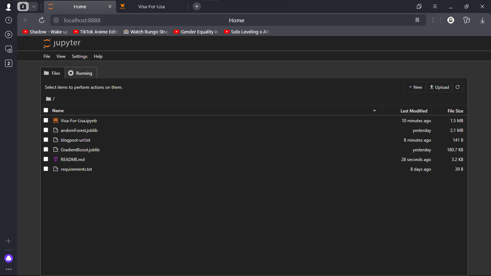

# Predictive Modeling for Loan Acceptance: Enhancing Marketing Strategies at Galaxy Bank - Visa for Lisa project

## Task

Visa For Lisa
Technical details	
Submit file	*.ipynb
Visa For Lisa
This project is about a bank (Galaxy Bank) whose management wants to explore converting some of its deposit customers to become personal loan customers (while retaining them as depositors). In short, they want to upsell customers to purchase more banking products from Galaxy Bank.

The bank has had some previous success in upselling to its deposit clients. Still, unfortunately, not all clients offered a loan by Galaxy Bank accept it and become a loan customers. The bank's campaign last year for its customers showed a healthy loan acceptance conversion rate of over 9%. This data has encouraged the marketing department to devise campaigns with better target marketing to increase the success ratio with a minimal budget.

The bank wants to predict better and identify who will accept loans offered to potential loan customers. It will help make their marketing efforts more effective with higher conversion rates.

Your mission

Your mission is to help Galaxy Bank improve its marketing conversion rates by allowing them to target and predict which of their deposit clients are most likely to accept a loan offer from the bank. You will be meeting with the marketing leadership at the bank.

What are the success criteria?

During our next meeting, you will have to show us some data (plot? report?) of what you've been building.
What do you think will happen to the conversion rate?
Your deliverables:

A presentation with slides.
Code that the DevOps team should be able to push to production.
You've heard the CEO will be joining the meeting. It's a reminder that, if you do well, you could quickly expect the promotion you have been hoping for.

Technical specification
Implement a multi-variable linear regression model on a large and complex data set
Analyze and evaluate the implications of your model on real-life users
Analyze and evaluate the risk to the business of the implications, assumptions, and decisions in your model
What to expect: the five stages of your project In this project, you should expect to cover the five major stages of working with data:

Data Collecting / Cleaning
Data Exploration
Data Visualization
Machine Learning
Communication
You will have to prove yourself in each of these. We are confident that you will succeed! :)

Where to find the data?

Loan DataSet
Reminder, this will be one of your portfolio projects. :-)

## Task
<div class="row">
<div class="col tab-content">
<div class="tab-pane active show" id="subject" role="tabpanel">
<div class="row">
<div class="col-md-12 col-xl-12">
<div class="markdown-body">
<p class="text-muted m-b-15">
</p><h2>Visa For Lisa</h2>
<table>
<thead>
<tr>
<th>Technical details</th>
<th></th>
</tr>
</thead>
<tbody>
<tr>
<td>Submit file</td>
<td>*.ipynb</td>
</tr>
</tbody>
</table>
<hr>
<h1>Visa For Lisa</h1>
<p>This project is about a bank (Galaxy Bank) whose management wants to explore converting some of its deposit customers to become personal loan customers (while retaining them as depositors). In short, they want to upsell customers to purchase more banking products from Galaxy Bank.</p>
<p>The bank has had some previous success in upselling to its deposit clients. Still, unfortunately, not all clients offered a loan by Galaxy Bank accept it and become a loan customers. The bank's campaign last year for its customers showed a healthy loan acceptance conversion rate of over 9%. This data has encouraged the marketing department to devise campaigns with better target marketing to increase the success ratio with a minimal budget.</p>
<p>The bank wants to predict better and identify who will accept loans offered to potential loan customers. It will help make their marketing efforts more effective with higher conversion rates.</p>
<p><em>Your mission</em></p>
<p>Your mission is to help Galaxy Bank improve its marketing conversion rates by allowing them to target and predict which of their deposit clients are most likely to accept a loan offer from the bank. You will be meeting with the marketing leadership at the bank.</p>
<p>What are the success criteria?</p>
<ul>
<li>During our next meeting, you will have to show us some data (plot? report?) of what you've been building.</li>
<li>What do you think will happen to the conversion rate?</li>
</ul>
<p>Your deliverables:</p>
<ul>
<li>A presentation with slides.</li>
<li>Code that the DevOps team should be able to push to production.</li>
</ul>
<p>You've heard the CEO will be joining the meeting. It's a reminder that, if you do well, you could quickly expect the promotion you have been hoping for.</p>
<h2>Technical specification</h2>
<ul>
<li>Implement a multi-variable linear regression model on a large and complex data set</li>
<li>Analyze and evaluate the implications of your model on real-life users</li>
<li>Analyze and evaluate the risk to the business of the implications, assumptions, and decisions in your model</li>
</ul>
<p>What to expect: the five stages of your project
In this project, you should expect to cover the five major stages of working with data:</p>
<ol>
<li>Data Collecting / Cleaning</li>
<li>Data Exploration</li>
<li>Data Visualization</li>
<li>Machine Learning</li>
<li>Communication</li>
</ol>
<p>You will have to prove yourself in each of these. We are confident that you will succeed! :)</p>
<p>Where to find the data?</p>
<ul>
<li><a href="https://storage.googleapis.com/qwasar-public/track-ds/Visa_For_Lisa_Loan_Modelling.csv" target="_blank">Loan DataSet</a></li>
</ul>
<p>Reminder, this will be one of your portfolio projects. :-)</p>

<p></p>
</div>

</div>
</div>
</div>
<div class="tab-pane" id="resources" role="tabpanel">
<div class="row">
<div class="col-xl-12">
<div class="row text-center">
<div class="col p-t-10 f-12">
<p>
How To Use Jupyter In Docode
</p>
</div>
</div>
<div class="row text-center">
<div class="col">
<a frameborder="0" href="https://www.youtube.com/embed/J5MpsvScKzE">Jupyter Notebook</a>
</div>
</div>

</div>
</div>
</div>
</div>
</div>

## Description

In this project, you'll be assisting Galaxy Bank in improving their marketing conversion rates by predicting which deposit clients are most likely to accept a loan offer from the bank. By implementing a multi-variable linear regression model on a large and complex dataset, you'll analyze, evaluate, and present insights that will guide the bank's marketing strategies.

## Installation

1. Clone repository from github.com
    ```
    git clone https://github.com/newjasjanpython/03-Machine-Learning-Visa-For-Lisa-/tree/Jasurbek_Abdulkhafizov.git
    ```

<<<<<<< HEAD
2. Make sure `jupyter notebook` is installed
    ```
    pip install jupyter notebook
    ```
=======
## Usage
1. **Clone the Repository:**
   ```bash
   git clone https://github.com/newjasjanpython/03-Machine-Learning-Visa-For-Lisa-.git
   cd 03-Machine-Learning-Visa-For-Lisa-
   ```
>>>>>>> b8f8f3154f867f955f862c760889d188d149d426

3. Run `jupyter notebook`
    ```
    jupyter notebook
    ```

4. Use web browser to run this codes

